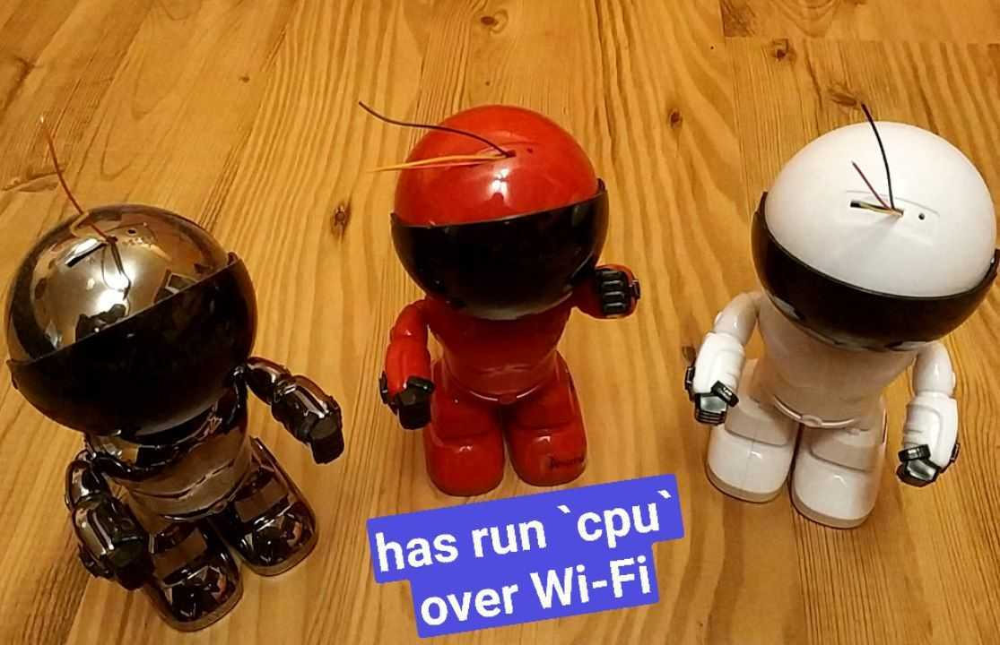

# cpu

[](https://circleci.com/gh/u-root/cpu)
[](https://goreportcard.com/report/github.com/u-root/cpu)
[](https://github.com/u-root/cpu/actions?query=workflow%3ACodeQL)
[](https://godoc.org/github.com/u-root/cpu)
[](https://github.com/u-root/cpu/blob/master/LICENSE)

This repo is an implementation the Plan 9 cpu command, both client and server, for Linux.
More detail is available in the [CPU chapter of the LinuxBoot book](https://book.linuxboot.org/cpu/).
Unlike the Plan 9 command, this version uses the ssh protocol for the underlying transport. It includes
features familiar to ssh users, such as support for the ssh config file.

## Overview
The cpu command
lets you log in from a local system to a remote system and see some or all of the files (how much is
up to you) from the local system.

This is wonderfully convenient for embedded systems programmers. Because some or all the files
can come from your local machine, including binaries, the only thing you need installed
on the remote machine is the cpu daemon itself.

### Motivation
Consider the case of running a
complex Python program on an embedded system.
We will need to either do a full install of some distro on that system, meaning we
need USB ports and local storage; or we will need to run the program over the
network.

Installing distros can turn into a mess. Some programs only work under specific distros.
In some cases, when two programs are needed in a pipeline, it can happen that they only work
under different distros!
Users are left juggling USB stucks and NVME cards, and this fails the first time there are
two programs which need two different distros.

Running over a network is usually done with ssh, but ssh can not supply the programs and files.
We would need to either set up a network file system, meaning
finding a sysadmin willing to set it up, and keep it working; or, trying to figure out which
files the program needs, and using rsync or scp to get them there. In some cases,
the target system might not have enough memory to hold those files!

Cpu looks like ssh, but with an important difference: it also provides a file transport
so that the files your program needs are available via a 9p mount. For example, if I have an
embedded system named camera, and I need to read the flash with the flashrom command, I simply type:

```
cpu camera flashrom -r rom.img
```



Breaking this down: cpu is the cpu command; camera is the host name; flashrom is the command
to run; the options are to do a read (-r) into a file called rom.img.

Where does that file end up? In whatever of my home directories I ran the cpu command from. I need
not worry about scp'ing it back, or any such thing; it's just there.

### Building your own docker container

You can easily build your own docker container to try things out.

```
docker build -t "${USER}/cpu:latest" .
```

or if you have installed a version of docker buildx, you can build a multi-arch manifest container and push it to docker hub:
```
% docker login
% docker buildx build --platform "linux/amd64,linux/arm64,linux/arm/v7" --progress plain --pull -t "${USER}/cpu:latest" .
```

There is a pre-built version of a multi-arch container here which you can substitute for the next section if you want to try out on arm (either arm64 or arm/v7): 
```
ericvh/cpu:latest
```

### Pre-build Docker container for trying out cpu (on x86 for now)

We have created a docker container so you can try cpu client and server:
```
rminnich/cpu:latest
```

It includes both the cpud (server) and cpu (client) commands. In the
container, you only have access to date and cat commands, but that is enough to get
the idea.

You will need keys. You can either use your own SSH keys that you use for
other things, for example:
```
export KEY=~/.ssh/id_rsa
export KEY=~/.ssh/a_special_key_for_this_docker
```

or generate one and use it.
```
ssh-keygen -f key -t rsa  -P ""
export KEY=`pwd`/key
```
NOTE! The name KEY is not required. Instead of KEY, you
can use any name you want, as long as you use it in the docker
command below.

To start the cpud, you need docker installed. Once that is done, you need to create
a docker network and start the daemon, with public and private keys.
The --mount option allows docker to provide the keys, using a bind mount
for both the private and public key.
That is how we avoid
storing keys in the container itself.
```
docker network create cpud
# If you ran docker before, you need to remove the
# old identity.
docker rm cpud_test
docker run --mount type=bind,source=$KEY.pub,target=/key.pub --mount type=bind,source=$KEY,target=/key --name cpud_test --privileged=true -t -i -p 17010:17010 rminnich/cpu:latest
```

Note: once the container is done, if you want to run it again with the
same named, cpud_test, you must:
```
docker rm cpud_test
```

Then you can try running a command or two:
```
docker exec -it  cpud_test  /bin/cpu -key /key localhost /bin/date
```

Remember, this cpu command is running in the container. You need to use the name /key in the
container, not $KEY.

To see the mounts:
```
docker exec -it  cpud_test  /bin/cpu -key /key localhost /bin/cat /proc/mounts
```

You might want to just get a cpu command to let you talk to the docker cpud
directly:
```
go install github.com/u-root/cpu/cmds/cpu@latest
```

And now you can run
```
cpu -key $KEY localhost date
```

### cpu on heterogeneous systems.

The cpu command sets up the various 9p mounts with a default namespace. Users can override this
default with the -namespace switch. The argument to the switch looks like
PATH variables, with comma-separated values, but with one extra option: users can, optionally,
specify the local path and the remote path. This is useful when running ARM binaries
hosted from an x86 system.

In the example below, we show starting up a bash on an ARM system (solidrun honeycomb) using
a cpu command running on an x86 system.

```
cpu -namespace /home:/bin=`pwd`/bin:/lib=`pwd`/lib:/usr=`pwd`/usr honeycomb /bin/bash
```

Breaking this down, we set up the namespace so that:
* the remote /home is from our /home
* the remote /bin is from `pwd`/bin -- which, in this case, was an unpacked arm64 file system image
* the remote /lib is from `pwd`/lib
* the remote /usr is from `pwd`/usr

We can use the path /bin/bash, because /bin/bash on the remote points to `pwd`/bin/bash on the local
machine.

## cpu will be familiar to ssh users

As mentioned, cpu looks and feels a lot like ssh, to the point of honoring ssh config files.
For the honeycomb, for example, the ssh config entry looks like this (we shorten the name to 'h'
for convenience):

```
Host h
	HostName honeycomb
	Port 17010
	User root
	IdentityFile ~/.ssh/apu2_rsa
```

Note that the cpu command is itself a 9p server; i.e., your instance of cpu runs your server. The remote
cpu server may run as root, but all file accesses happen locally as you. Hence,
the cpu command does not grant greater access to the local machine than you already possess.
I.e., there is no privilege escalation.

## cpu and Docker

Maintaining file system images is inconvenient.
We can use Docker containers on remote hosts instead.
We can take a standard Docker container and, with suitable options, use docker
to start the container with cpu as the first program it runs.

That means we can use any Docker image, on any architecture, at any time; and
we can even run more than one at a time, since the namespaces are private.

In this example, we are starting a standard Ubuntu image:
```
docker run -v /home/rminnich:/home/rminnich -v /home/rminnich/.ssh:/root/.ssh -v /etc/hosts:/etc/hosts --entrypoint /home/rminnich/go/bin/cpu -it ubuntu@sha256:073e060cec31fed4a86fcd45ad6f80b1f135109ac2c0b57272f01909c9626486 h
Unable to find image 'ubuntu@sha256:073e060cec31fed4a86fcd45ad6f80b1f135109ac2c0b57272f01909c9626486' locally
docker.io/library/ubuntu@sha256:073e060cec31fed4a86fcd45ad6f80b1f135109ac2c0b57272f01909c9626486: Pulling from library/ubuntu
a9ca93140713: Pull complete
Digest: sha256:073e060cec31fed4a86fcd45ad6f80b1f135109ac2c0b57272f01909c9626486
Status: Downloaded newer image for ubuntu@sha256:073e060cec31fed4a86fcd45ad6f80b1f135109ac2c0b57272f01909c9626486
WARNING: The requested image's platform (linux/arm64/v8) does not match the detected host platform (linux/amd64) and no specific platform was requested
1970/01/01 21:37:32 CPUD:Warning: mounting /tmp/cpu/lib64 on /lib64 failed: no such file or directory
# ls
bbin  buildbin	env  go    init     lib    proc  tcz  ubin  var
bin   dev	etc  home  key.pub  lib64  sys	 tmp  usr
#
```

Note that the image was updated and then started. The /lib64 mount fails, because there is no /lib64 directory in the image, but
that is harmless.

On the local host, on which we ran docker, this image will show up in docker ps:
```rminnich@a300:~$ docker ps
CONTAINER ID   IMAGE     COMMAND                  CREATED         STATUS         PORTS     NAMES
b92a3576229b   ubuntu    "/home/rminnich/go/b…"   9 seconds ago   Up 9 seconds             inspiring_mcnulty
````

Even though the binaries themselves are running on the remote ARM system.

## Testing with vsock

Vsock is a useful transport layer available in Linux, and support by at least QEMU.

We use the mdlayher/vsock package.

In the cpu and cpud, the switch
```
-net vsock
```
will enable vsock.

In the host kernel, you need ```vhost_vsock``` module:
```
sudo modprobe vhost_vsock
```
.

When starting qemu, add
```
-device vhost-vsock-pci,id=vhost-vsock-pci0,guest-cid=3
```
to the command line. The '3' is arbitrary; it just needs to be agreed upon on both sides.

When running a cpu command, the host name is the vsock guest-cid you specified in qemu:
```
cpu -net vsock 3 date
```

If you want a different port, you can use the same -sp switch you use for other network types.

## Summary
The cpu command makes using small embedded systems dramatically easier. There is no need to install
a distro, or juggle distros; there is no need to scp files back and forth; just run commands
as needed.

## Development

For debugging, `tcpdump` is very handy. Read [a short tutorial](
https://danielmiessler.com/study/tcpdump/) to get familiar with it.

## Further reading

### Talks

* Short Talk "building small stateless network-controlled appliances with
  coreboot/linuxboot and u-root’s cpu command"
  * at Open Source Firmware Conference 2019
   [slides](https://docs.google.com/presentation/d/1ee8kxuLBJAyAi-xQqE75EMk-lNM5d8Z6CarWoYlO6Ws/edit?usp=sharing) /
   [recording](https://www.youtube.com/watch?v=mxribsZFDQQ)
  * at BARC2021
   [slides (PDF)](https://bostonarch.github.io/2021/presentations/U-root%20CPU%20command.pdf)
* [Network Managed Processors at IoT World 2021](https://docs.google.com/presentation/d/1jREHiHci1EAMWdj--6uX9o0aVpeCPy21UQpnl1oTSwE/edit?usp=sharing)
* ["Plan 9 CPU command, in Go, for Linux - the network is the computer -- for real this time" at FOSDEM 2022
  ](https://fosdem.org/2022/schedule/event/plan_9_cpu_cmd/)
* ["Drivers From Outer Space at CLT 2022 - Fast, Simple Driver Development"
  ](https://chemnitzer.linux-tage.de/2022/de/programm/beitrag/226)

### History

The first version of cpu was developed for Plan 9, and is described [here](http://man.cat-v.org/plan_9/1/cpu).
